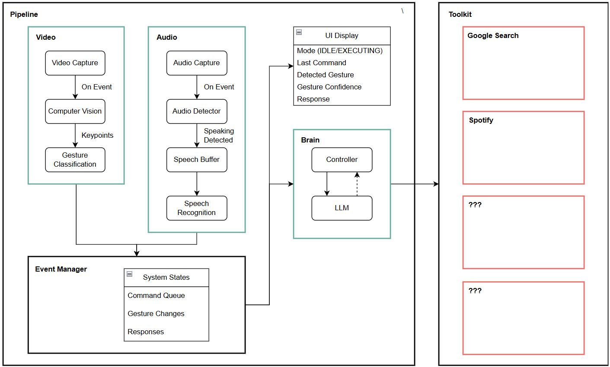

# Jarvis Simulator

#### If you're reading this...

This is a personal project using computer vision techniques, speech recognition and NLP. Truth be told, I was inspired by a TikTok video I watched and wanted to do the same for myself...

But instead of copying a demo, I wanted to be able to gloat that I built one on my own.

No external APIs. No vibe coding.

---

### The goal?

To achieve an event-driven multimodal AI system that integrates compuer vision, speech recognition, and an extensible cognitive control module to simulate an interactive assistant like **Jarvis, from Iron Man**. More specifically;
1. Real-time video and gesture recognition
2. Voice activity detection and speech-to-text transcription
3. A structured "brain" module to control actions
4. Tools to execute specific actions

---

### The motivation.

#### It was time to practice.

Internship application season is open and I needed practice in Python and Machine Learning again. As a year 1 student in CS, the syllabus is still covering programming basics like OOP concepts, recursion, data structures, all of which would probably not be enough for employers to care about me.

Furthermore, school had been eating up my free time, which left me with small pockets of time to work on side projects. However, seeing the CNY and recess week 2 week break coming up, I knew it was the perfect opportunity to build something quick while studying for my midterms.

#### I hate ChatGPT wrappers.

Seeing people build products that wrap some LLM and gloat about it online disgusted me. I didn't want to build some simple chatbot within a single pipeline, run it on localhost:3000 and call it a day.

I wanted to attempt some extensive and complex architecture, to build datasets and train my own models, and to mirror real-world autonomous systems.

---

### Overarching Structure

The system is built around an event-driven, multimodal pipeline, pieced together in a modular architecture with different independent layers that communicate through a central controller.



To put it very simply,
```
Sensors (video/audio)
↓
Event Manager
↓
Cognitive Layer (brain)
↓
Tool Execution Layer
↓
Output (display)
```

#### 1. **Sensors**

The sensors used can be from the same device or different, but to accomadate different devicecs with different recording rates (e.g. FPS, Hz), the sensors need to be running on different loops. Each loop will run concurrently, using **asyncio**, and carry out their own logic separately. 

- **Video: Camera**

    - Constant video feed 
    - YOLO pose model running per frame (**to change**) for keypoint detection
    - Gesture detection using KNN classifier + scaler

    Gestures are treated as **continuous signals**. The user can put up a gesture for an extended period of time to indicate a continuous activity (e.g. listening, pausing). Only changes in gesture state should be considered actionable events.

- **Audio: Microphone**

    - Constant audio feed
    - Voice activity detection
    - Speech buffering 
    - Speech-to-text model Whisper model

    Audio feed is a continuously running loop, but speech segmentation should only be run if noise goes above a certain dynamic threshold. Speech also cannot be too short each time it is sent to the STT model. Each classified command is considered an actionable event.

#### 2. **Brain Module**

- **Event Manager**

    The core coordination layer that stores system states (e.g. gesture, command, response), maintains a command queue, tracks gesture changes and handles concurrency via **async locks**.

    An important design decision here is to **separate execution signals from display states**. Commands are queued and executed once, and gestures are detected only when a change is detected, but UI is never destroyed.

- **Controller**

    The controller handles the different gesture and command logics.

    - **Voice commands** are routed through the LLM for action planning before a tool execution or response generation.

    - **Visual gestures** are mapped to specific actions that call certain tools or get sent for response generation.

    If an action is required, an action plan (JSON) is generated and used for tool execution.

- **LLM Module**

    Instead of using a high-level pipeline wrapper or API, I wanted to implement a local model for future plug-and-play use cases, also allowing more deterministic controls (e.g. temperature, output planning, device management).
    
    The model serves two main roles; **tool planning** and **conversational roles**.

#### 3. **Tools**

The tools are the deterministic execution layer, where each tool is explicitly listed with a defined interface, and is only executed after validation;.

The current selection of tools is limited, but includes;

- Spotify Control
- Browser Search
- System Commands
- Data Retrieval

In the ideal scenario, these tools can interact with local systems more intrusively, while being secure of course. 

---

### Model Training

---

### Difficulties/Limitations

1. **Architecture/system design**

2. **Running local models**

3. **Context/Memory**
